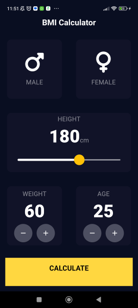
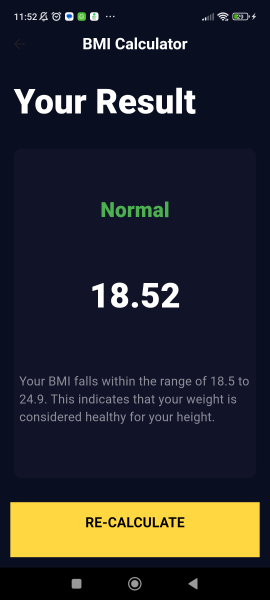

# Bmicalculator

This is a simple BMI (Body Mass Index) calculator app built using Flutter. The app allows users to calculate their BMI based on their weight and height inputs.

## Features
- Calculate BMI: Input your weight (in kilograms) and height, and the app will calculate your BMI.
- Interpret BMI: The app interprets the calculated BMI value and provides information on whether the user is underweight, normal weight or overweight.
- Easy-to-Use Interface: The user interface is designed to be simple and intuitive, making it easy for users to input their data and view the results.

## Screenshots

  
  

## Getting Started

This project is a starting point for a Flutter application.

A few resources to get you started if this is your first Flutter project:

- [Lab: Write your first Flutter app](https://docs.flutter.dev/get-started/codelab)
- [Cookbook: Useful Flutter samples](https://docs.flutter.dev/cookbook)

For help getting started with Flutter development, view the
[online documentation](https://docs.flutter.dev/), which offers tutorials,
samples, guidance on mobile development, and a full API reference.
